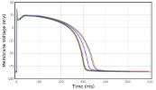
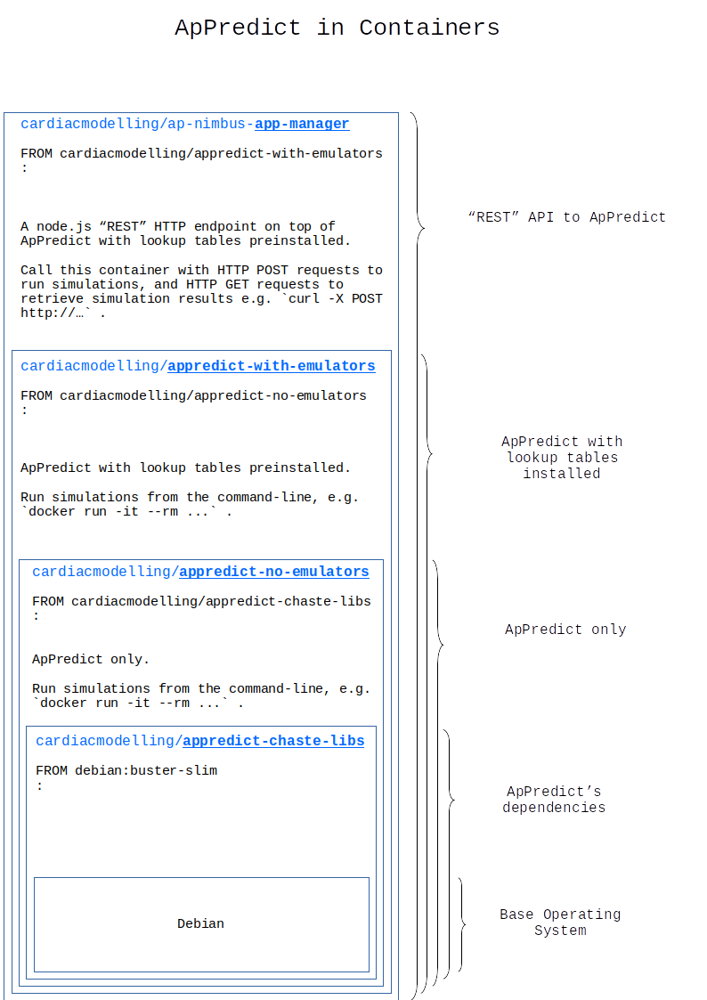
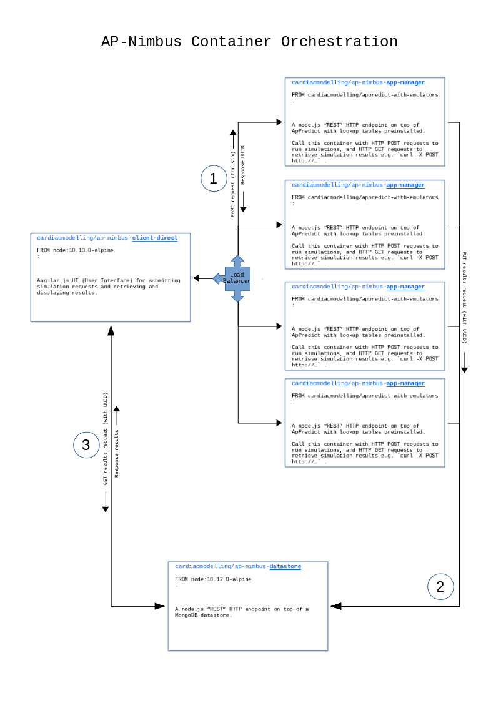

.. include:: global.rst

Welcome to AP-Nimbus's documentation
====================================

:Project Home: https://github.com/CardiacModelling/ap-nimbus
:Documentation: https://ap-nimbus.readthedocs.io/
:Created: |today|
:Version: |release|

IMPORTANT
---------

This activity represents the next step in the development of the original
`AP-Portal <https://apportal.readthedocs.io/en/latest/>`_ work -- towards a
container-based / cloud solution.

|AP-Nimbus| is available at https://github.com/CardiacModelling/ap-nimbus and is
being developed by the `University of Nottingham <https://www.nottingham.ac.uk/>`_\ 's
`School of Mathematical Sciences <https://www.nottingham.ac.uk/mathematics/research/>`_ .

Preamble
--------

 * Unlike `AP-Portal <https://apportal.readthedocs.io/en/latest/>`_, this work
   includes the installation of |ApPredict|, the cardiac simulation software.
 * Also unlike |AP-Portal|, this work, by nature of containerisation, means that
   |AP-Nimbus| work does not embody a single application, it is instead a
   collection of containers where each can operate in isolation, e.g. as a
   standalone |docker| or |singularity| container, or alternatively, orchestrated
   in a microservice architecture (e.g. |kubernetes| or |docker_compose|).

Singularity
-----------

This documentation predominantly covers |docker| container environments, however
it has been relatively straightforward to create `Singularity <https://sylabs.io/>`_
containers (e.g. ``singularity build app-manager.img docker://cardiacmodelling/ap-nimbus-app-manager:0.0.10``)
and use those [#f1]_.

Sample invocation scripts can be found at `ap-predict-online <https://bitbucket.org/gef_work/ap_predict_online>`_\'s
`app-manager --> tools <https://bitbucket.org/gef_work/ap_predict_online/src/master/app-manager/tools/>`_  section.

Diagrammatic Representation
---------------------------

For the role each of the containers has in the overall |AP-Nimbus| activity please
see :ref:`activity-overview`.

ApPredict
^^^^^^^^^

`ApPredict <https://github.com/Chaste/ApPredict>`_ is the underlying cardiac 
simulation engine.

Building or installing |ApPredict| is a complex and time-consuming
process and by distributing in container form it's possible to have it installed
in a fraction of the time [#f2]_.

.. warning:: |ap-nimbus-app-manager| does not currently handle either of |PKPD| or
             Dynamic CellML operations. These activities can only take place when
             using the |CLI| |appredict-no-emulators| or |appredict-with-emulators|.

Orchestration
^^^^^^^^^^^^^

The following illustrates a microservice-based solution to potentially running many
|ApPredict|\s concurrently.

It is equally feasible to run as .. :

 * Containerised

   * ``docker run ..`` a single |ap-nimbus-app-manager| container and
     call it with |HTTP| ``POST`` and ``GET``  requests, or;

   * ``docker run ..`` either of the |appredict-with-emulators| or
     |appredict-no-emulators| containers directly from a |CLI| to run their internal
     |ApPredict|\s, or;

 * Non-containerised

   *  Running the various components without using containers is technically possible, but not reccomended or supported. See :ref:`developer` for suggestions on how to develop the components using containers.

.. seealso:: For instructions on how to run containers, see the more detailed section on
             :ref:`running`.

Activity Overview
-----------------

.. toctree::
   :maxdepth: 2

   activity-overview/index

Installation
------------

.. toctree::
   :maxdepth: 2

   installation/index

Security
--------

.. toctree::
   :maxdepth: 2

   security/index

Running
-------

.. toctree::
   :maxdepth: 2

   running/index

Troubleshooting
---------------

.. toctree::
   :maxdepth: 2

   troubleshooting/index

Developer Section
-----------------

.. toctree::
   :maxdepth: 2

   developer/index

.. rubric:: Footnotes

.. [#f1] |singularity| containers (or rather, a |singularity| version of just
         |ap-nimbus-app-manager| so far) have been trialled operating in isolation,
         not in an orchestrated environment. 
.. [#f2] So long as there's a container runtime, e.g. |docker|, running somewhere!
